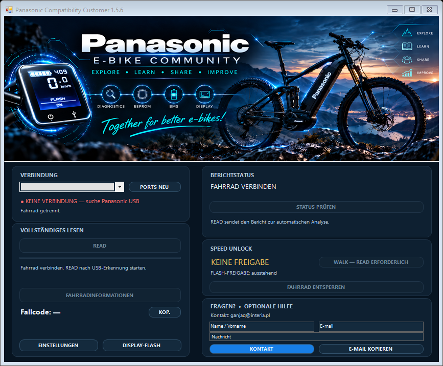
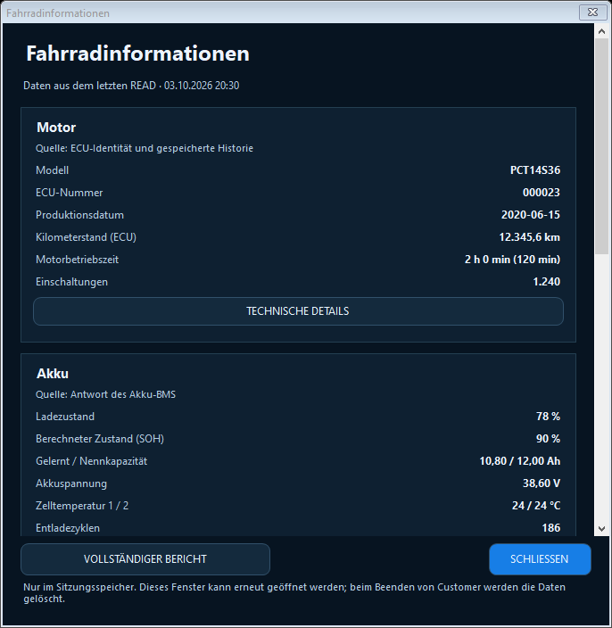
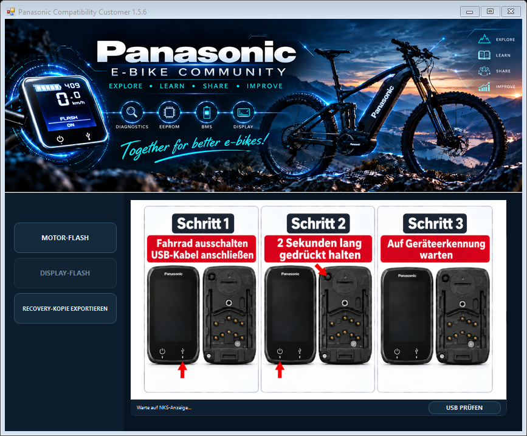

# Panasonic NEXT GEN Compatibility Customer 1.5.6

[Polski](README.md) · [English](README.en.md) · **Deutsch**

**Beta-Ausgabe — Build 1.5.6.3, EXE ohne digitale Signatur.** Windows kann eine SmartScreen-Warnung anzeigen. Deaktivieren Sie keine Systemschutzfunktionen; prüfen Sie vor dem Start die Herkunft des Pakets und die SHA-256-Prüfsummen. Neu unterstützte Gerätefamilien bleiben bis zur Prüfung an realer Hardware experimentell.

**[Vollständiges Beta-ZIP-Paket herunterladen](https://github.com/ganjaq/Panasonic_NEXT_GEN_Customer_1.5.6.2-beta/releases/download/v1.5.6.3-beta/PanasonicCustomer_1.5.6.3-beta.zip)** — entpacken Sie alles in einen Ordner. Das Paket enthält das Programm, die Bibliotheken, den Treiber und die Dokumentation; einzelne Downloads sind nicht erforderlich. Alle Dateien und die ZIP-Prüfsumme finden Sie unter [Releases](https://github.com/ganjaq/Panasonic_NEXT_GEN_Customer_1.5.6.2-beta/releases/tag/v1.5.6.3-beta).

Panasonic NEXT GEN Compatibility Customer ist eine Anwendung für Nutzer von Elektrofahrrädern mit Panasonic-Next-Gen-Antrieb. Sie liest Fahrradinformationen aus, ermöglicht Diagnosen und prüft, ob die Unterstützungsschwelle und die Schiebehilfe verändert werden können. Diese Funktionen werden im Folgenden als **SPEED** und **WALK** bezeichnet. Außerdem können unterstützte Displays aktualisiert und um zusätzliche Funktionen erweitert werden.

Das Programm erkennt das angeschlossene Fahrrad und prüft dessen Kompatibilität, bevor es einen Vorgang ermöglicht. Die verfügbaren Funktionen hängen von Modell, Generation, Version und Ausleseergebnis ab. Nicht jedes Fahrrad mit Panasonic-System kann unterstützt werden.

Dies ist ein unabhängiges, hobbymäßiges Gemeinschaftsprojekt der Panasonic E-Bike Community, betrieben von **ganjaq**. Es handelt sich weder um offizielle Panasonic-Software noch um ein vom Hersteller unterstütztes Projekt.

## Kostenlose Anwendung und zusätzliche Dienstleistungen

Das Herunterladen und die Nutzung der Customer-Anwendung sind kostenlos. Auch READ, die erste Kompatibilitätsprüfung und Informationen über verfügbare Änderungen sind kostenlos. Derzeit werden auch für die weitere Bearbeitung eines Vorgangs keine Gebühren erhoben.

Künftig können eine individuelle Softwareanalyse oder eine Dienstleistung zur Softwareänderung kostenpflichtig angeboten werden. Dies wäre ein separates, optionales Angebot mit Angaben zu Umfang, Preis und Bedingungen vor der Bestellung. Das Herunterladen des Programms oder die Durchführung von READ begründet keine Zahlungspflicht. Eine zusätzliche Berechtigung ist für sich genommen kein Kauf.

## Windows und Voraussetzungen

Das Paket ist für Windows 10 x86/x64 und Windows 11 x64 vorgesehen. Windows 11 ARM64, Linux und macOS werden von dieser Version nicht unterstützt.

- **.NET Framework 4.8** ist erforderlich.
- Die vollständige Treiberinstallation und -prüfung mit dem mitgelieferten Installationsprogramm erfordert **Windows 10 1903 oder neuer** oder Windows 11 x64.
- Das aktuelle Paket wurde unter Windows 10 22H2 x64 geprüft. Die vollständige Funktion aller Vorgänge wurde nicht für jede Windows-Version bestätigt. Die Liste der Zielplattformen stellt keine solche Garantie dar.
- Benötigt werden ein Computer oder Laptop mit dem heruntergeladenen EXE-Paket, ein USB-Kabel und ein kompatibles Fahrrad.
- Im normalen READ-Ablauf ist eine Internetverbindung für die Bearbeitung des Vorgangs, das Übermitteln des Berichts, die Analyse und das Abrufen von Berechtigungen erforderlich. Sie wird außerdem zum Herunterladen des Display-Images, zur Abwicklung autorisierter Vorgänge und zur Übermittlung ihrer Ergebnisse benötigt.
- Die Treiberinstallation erfordert die Zustimmung eines Windows-Administrators. Das bedeutet nicht, dass jeder Start von Customer erhöhte Rechte benötigt.

Folgende Dateien müssen sich im selben Ordner befinden:

- `PanasonicCompatibilityCollector_v1.5_CUSTOMER.exe`
- `PanasonicCompatibilityCollector_v1.5_CUSTOMER.exe.config`
- `PanasonicReadCore.dll`
- `STDFU.dll`
- `STTubeDevice30.dll`

Bewahren Sie auch den Ordner `drivers/ST_DFU` mit seinem vollständigen Inhalt auf. Mit [SHA256SUMS.txt](SHA256SUMS.txt) lässt sich die Integrität des Pakets prüfen.

## Erster Start und READ

1. Laden Sie das Dateipaket herunter und entpacken Sie es in einen einzigen Ordner. Starten Sie die EXE nicht direkt aus einem ZIP-Archiv.
2. Lesen Sie die [Nutzungsbedingungen](TERMS_OF_USE.md), die [Datenschutzerklärung](PRIVACY_POLICY.md) und die [Lizenz](LICENSE.txt). Diese Dokumente liegen in ihrer polnischen Originalfassung vor. READ übermittelt technische Daten an den Dienst und zeigt sie nicht nur auf dem Computer an.
3. Stellen Sie eine Internetverbindung her und starten Sie `PanasonicCompatibilityCollector_v1.5_CUSTOMER.exe`.
4. Schließen Sie das Fahrrad mit dem passenden USB-Kabel an. Warten Sie auf die Erkennung der Verbindung; wählen Sie bei Bedarf den richtigen Port aus.
5. Klicken Sie auf **READ** und warten Sie, bis das Auslesen und die Bearbeitung des Berichts abgeschlossen sind.
6. Prüfen Sie den Vorgangscode, das Analyseergebnis und den aktuellen Funktionsstatus. Bei einem unvollständigen Auslesen oder einem Fehler ist der Code allein keine Bestätigung der Kompatibilität.

READ dient dem Auslesen und verändert die Konfiguration des Fahrrads nicht. Es handelt sich jedoch nicht um einen vollständig offline nutzbaren Modus: Die Anwendung prüft den Vorgang beim Dienst und kann auch einen erneuten Auslesevorgang zu einem bestehenden Vorgang übermitteln. Eine fehlende Internetverbindung kann die Bearbeitung unterbrechen; die Erstellung einer neuen Berichtsdatei ist in diesem Fall nicht garantiert.

Die Sprache der Benutzeroberfläche lässt sich unter **EINSTELLUNGEN** ändern. Polnisch, Englisch und Deutsch stehen zur Verfügung.

## Erstellung des Berichts

Ein gesonderter EEPROM-Export muss nicht ausgewählt werden. Der Diagnosebericht wird während READ aus den vom Fahrrad gelieferten Antworten erstellt.

Ein erneuter READ zu einem bestehenden Vorgang kann übermittelt werden, ohne einen neuen Berichtscode zu erzeugen.

Der Diagnosebericht ist kein öffentlicher Anhang und nicht automatisch eine einsatzbereite Kopie zur Wiederherstellung des Geräts. Veröffentlichen Sie keine Berichte, Backups oder Zugangsdaten in öffentlichen GitHub-Issues. Einzelheiten zur Übermittlung und Speicherung der Daten beschreibt die [Datenschutzerklärung](PRIVACY_POLICY.md).

## Automatische Löschung der Dumps nach 30 Tagen

Vollständige Diagnoseberichte, Rohantworten und der vollständige EEPROM-Dump werden vorübergehend für die Analyse und die Bearbeitung des Vorgangs gespeichert. Die automatische Bereinigung im Backend löscht sie nach **30 Tagen ab Erstellung des Vorgangs**, nachdem die gespeicherten Daten zur späteren Erkennung des Fahrrads überprüft wurden. Die Frist beginnt nicht beim Schließen des Programms oder beim letzten READ.

Ein ausstehender oder unbestätigter SPEED/WRITE/WALK verhindert die Löschung des vollständigen Dumps nicht, sofern der überprüfte Erkennungsdatensatz und die erforderlichen Operationsmaterialien erhalten bleiben. Vor einem neuen Schreibvorgang ist ein aktueller, überprüfter READ dieses Fahrrads erforderlich; die Erkennung allein erteilt keine Schreibberechtigung. Die Bereinigung läuft im Hintergrund. Schlägt die Überprüfung der erhaltenen Daten oder die Löschung fehl, wird die Löschung nicht als abgeschlossen markiert und das System versucht es erneut. Die Frist von 30 Tagen garantiert keine sekundengenaue Löschung. Diese Regel gilt für Backend-Daten, nicht für lokale Wiederherstellungskopien des Displays.

## Fahrradinformationen

Nach einem Auslesevorgang, aus dem Fahrradinformationen erstellt werden können, wird die Schaltfläche **FAHRRADINFORMATIONEN** freigeschaltet. Sie öffnet ein separates Fenster mit einer einzigen scrollbaren Spalte. Die Daten sind nach ihrer Quelle gegliedert:

- **Motor:** Modell, ECU-Nummer, Produktionsdatum, in der ECU gespeicherter Kilometerstand, Betriebszeit und Anzahl der Starts — abhängig vom Ausleseergebnis.
- **Akku:** verfügbare BMS-Daten, beispielsweise Ladezustand, Spannung, Kapazitäten, berechneter Gesundheitszustand (SOH), Temperaturen und Zykluszähler. Eine fehlende Antwort des Akkus wird nicht durch erfundene Werte ersetzt.
- **Display:** unterstützte Angaben zu Hardware, Software, Seriennummer und gespeichertem Kilometerstand.
- **Gespeicherte Diagnosedaten:** verfügbare historische Ereigniszähler und zusätzliche technische Daten mit Beschreibung ihrer Quelle.

SOH ist ein Kapazitätsindikator und keine Bewertung der Akkusicherheit. Die Kilometerstände von Motor und Display können voneinander abweichen. Historische Ereignisse bedeuten nicht automatisch, dass zum Zeitpunkt des Auslesens ein Fehler vorliegt.

Die Informationen zeigen den Zustand aus dem Auslesevorgang und keine Live-Messung. Das Fenster speichert oder exportiert keine Daten in eine Datei. Nach dem Schließen des Fensters bleibt die Ansicht bis zum Ende der Programmsitzung erhalten; ein weiterer Auslesevorgang kann sie aktualisieren. Das vollständige Schließen von Customer beendet diese Sitzung. Dadurch werden weder Vorgangsdaten noch Berichte beim Dienst gelöscht — dafür bestehen separate Mechanismen.

## SPEED und WALK

**SPEED** ermöglicht es, die Unterstützungsschwelle bei einem geeigneten Fahrrad zu verändern. Die Wirkung hängt von der unterstützten Konfiguration ab; bei Tests wurde festgestellt, dass dieselben Änderungen je nach Motor unterschiedliche Ergebnisse liefern. Bei manchen Motormodellen kann die erreichte Höchstgeschwindigkeit etwas höher als die zuvor angenommenen 32 km/h sein.

**WALK** verändert die Funktion der Schiebehilfe. Bei unterstützten Konfigurationen beträgt das Konfigurationsziel **25 km/h**. Die tatsächliche Wirkung hängt vom Gerät und den Nutzungsbedingungen ab (Eigengewicht und Gelände). Die Funktion bleibt als **TESTFUNKTION** gekennzeichnet, obwohl ihre Wirkung an den getesteten Exemplaren nachgewiesen wurde.

Zusätzliche Berechtigungen ermöglichen die Nutzung kompatibler Funktionen. Die Grundfunktionen sind derzeit kostenlos. Zahlungsbezogene Bezeichnungen in der Benutzeroberfläche begründen für sich genommen keine Gebühr.

SPEED und WALK werden getrennt gestartet. Vor dem Schreiben prüft das Programm das angeschlossene Fahrrad erneut und führt danach ein bestätigendes Auslesen durch. Der Beginn eines Vorgangs bedeutet nicht dessen Abschluss. Wiederholen Sie bei einem unbestätigten Ergebnis den Schreibvorgang nicht blind: Prüfen Sie den Zustand und wenden Sie sich an den Support.

## Display — DISPLAY FLASH und Backup

DISPLAY FLASH ermöglicht die Identifikation eines unterstützten Displays, die Erstellung einer Sicherungskopie und das Schreiben eines kompatiblen Images.

1. Führen Sie im Hauptfenster READ aus.
2. Öffnen Sie **DISPLAY FLASH**.
3. Wechseln Sie gemäß der Anleitung in der Anwendung in den Bootloader-Modus. Dieser USB-Modus unterscheidet sich von der vorherigen Verbindung.
4. Führen Sie **READ BACKUP** aus.
5. Warten Sie auf den Abschluss der Sicherung und der Kompatibilitätsprüfung. Schreiben ist nur möglich, wenn die Anforderungen des Programms erfüllt sind.

Unterstützt werden die bestätigten Varianten **NKS348S** und **NKS442S** mit Hardwarekennung **8001**, Software **0210** und **SW0**. Das Programm prüft den ausgelesenen Inhalt — der Name des Displays allein bestätigt keine Kompatibilität.

Die Display-Sicherung wird lokal unter **%LOCALAPPDATA%\PanasonicCollector\NksBackups** gespeichert und für den aktuellen Windows-Benutzer geschützt. Mit **EXPORT RECOVERY COPY** lässt sich eine Wiederherstellungskopie an einen frei gewählten Ort exportieren. Bewahren Sie diese vor einem Wechsel des Computers oder Windows-Kontos auf. Das Schließen des Programms löscht diese Sicherungen nicht.

Ein READ-Bericht ersetzt keine unabhängige, überprüfte Sicherung zur Wiederherstellung des Motors. Diese Customer-Version bietet keine universelle Wiederherstellung beliebiger Geräte aus einem READ-Bericht.

### Tempomat

Ein kompatibles Display-Image kann WALK ohne dauerhaftes Gedrückthalten der Taste ermöglichen; diese Funktion wird als **TEMPOMAT** bezeichnet. Aktivieren Sie diese Option bei der unterstützten Variante im versteckten Menü des Displays und halten Sie anschließend die Schiebehilfetaste etwa 2 Sekunden lang gedrückt. Laut Anleitung dieser Variante wird die Funktion durch Drücken einer Taste der Bedieneinheit oder bei ausreichendem Geschwindigkeitsabfall während des Bremsens ausgeschaltet. Gehen Sie bei einem anderen Image oder Display nicht von identischem Verhalten aus; prüfen Sie die Anleitung und die Funktion unter sicheren Bedingungen.

## USB-DFU-Treiber — PnPUtil, ohne DPInst

Das ST-Treiberpaket befindet sich unter **drivers/ST_DFU**. Wenn das Display im DFU-Modus nicht erkannt wird:

1. Bewahren Sie den vollständigen Treiberordner einschließlich der Unterordner x86/x64 auf. Installieren Sie den Treiber nicht während READ BACKUP oder FLASH.
2. Starten Sie `drivers/ST_DFU/Install_DFU.cmd` und bestätigen Sie die Installation sowie die Windows-Administratorabfrage.
3. Schließen Sie ein unterstütztes Display im DFU-Modus an und wählen Sie anschließend **USB DFU AKTUALISIEREN** oder **USB PRÜFEN** in Customer.

Das Installationsprogramm verwendet **PnPUtil, das mit Windows geliefert wird**. Die Treiberinstallation schreibt keine Firmware. Die Bestätigung, dass das Paket ohne angeschlossenes Gerät hinzugefügt wurde, bestätigt keine Kommunikation mit dem Display. Nicht jeder USB-Fehler wird durch einen fehlenden Treiber verursacht.

Die Installation kann auch über ein als Administrator geöffnetes Terminal im Programmordner erfolgen:

```powershell
pnputil /add-driver ".\drivers\ST_DFU\STtube.inf" /install
```

Der Befehl installiert das Originalpaket auf passenden Geräten; er erzwingt nicht den Austausch eines besser passenden Treibers. `/add-driver /install` selbst ist ab Windows 10 1607 verfügbar, die vollständige abschließende Schnittstellenprüfung unseres Installationsprogramms erfordert jedoch 1903 oder neuer. Deaktivieren Sie die Überprüfung von Treibersignaturen nicht.

Siehe die [Treiberanleitung](drivers/ST_DFU/README.de.md), die [Microsoft-Dokumentation zu PnPUtil](https://learn.microsoft.com/en-us/windows-hardware/drivers/devtest/pnputil-command-syntax) und das [Originalpaket DfuSe von ST](https://www.st.com/en/development-tools/stsw-stm32080.html). Für ST-Komponenten gilt die vollständige [Lizenz SLA0044](drivers/ST_DFU/SLA0044.txt).

## Warnung zu WRITE/FLASH

WRITE/FLASH kann die Konfiguration oder Software eines Geräts verändern. Ein Fehler, eine inkompatible Datei oder eine Unterbrechung der Stromversorgung oder USB-Verbindung kann zu Datenverlust oder fehlerhaftem Betrieb führen. Eine Sicherung verringert das Risiko, garantiert jedoch weder eine Reparatur noch die Wiederherstellung in jeder Situation.

Führen Sie Vorgänge nur an Geräten durch, zu deren Wartung Sie berechtigt sind. Trennen Sie während des Schreibens weder USB noch die Stromversorgung. Testfunktionen garantieren weder Sicherheit noch Kompatibilität mit jedem Modell oder eine Zulassung für den Straßenverkehr. Änderungen können die Sicherheit, die Herstellergarantie und die Pflichten im Zusammenhang mit der Fahrzeugnutzung beeinflussen. Prüfen Sie die am Einsatzort geltenden Vorschriften.

## Hilfe und Kontakt

Kontakt: [ganjaq@interia.pl](mailto:ganjaq@interia.pl).

Geben Sie die Programmversion, den Vorgangscode und die Phase an, in der das Problem aufgetreten ist. Das Formular in der Anwendung erstellt eine Nachricht in Ihrem E-Mail-Programm; Sie versenden sie selbst. Veröffentlichen Sie keine Berichte, Backups, Zugangsdaten oder Screenshots mit Daten anderer Personen. Das Projekt ist hobbymäßig; es verspricht weder einen Rund-um-die-Uhr-Support noch eine garantierte Antwortzeit.

## Dokumente und Vorschau

Die folgenden Dokumente liegen in ihrer polnischen Originalfassung vor:

- [Nutzungsbedingungen](TERMS_OF_USE.md)
- [Datenschutzerklärung](PRIVACY_POLICY.md)
- [Lizenz für die eigenen Programmkomponenten](LICENSE.txt)







Programmversion: **1.5.6**, Beta-Build **1.5.6.3**. Polnischer Text vom Eigentümer am 7. Oktober 2026 genehmigt; Angaben zur Aufbewahrung und zur Beta-Ausgabe am 8. Oktober 2026 aktualisiert. README ist auch auf Polnisch und Englisch verfügbar. Die Datenschutzerklärung beschreibt die bereitgestellte automatische Bereinigung, kennzeichnet aber weiterhin ungeprüfte Fragen zur Infrastruktur und zu den Rechtsgrundlagen. Eine Beta-Ausgabe bedeutet nicht, dass diese Prüfungen abgeschlossen sind.
