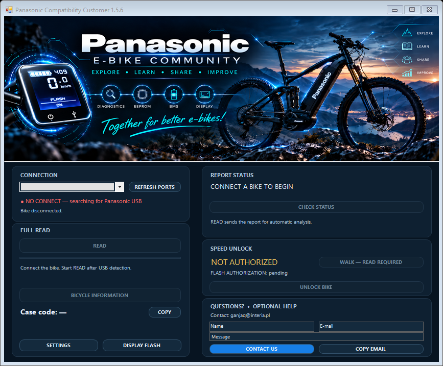
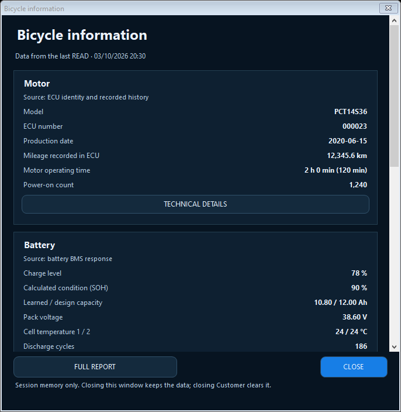
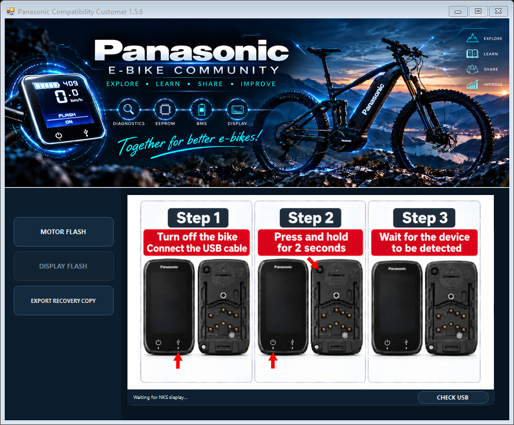

# Panasonic NEXT GEN Compatibility Customer 1.5.6

[Polski](README.md) · **English** · [Deutsch](README.de.md)

**Beta release — build 1.5.6.3, digitally unsigned EXE.** Windows may show a SmartScreen warning. Do not disable system protections; check the package source and SHA-256 checksums before running it. Newly supported device families remain experimental until verified on physical hardware.

**[Download the complete beta ZIP package](https://github.com/ganjaq/Panasonic_NEXT_GEN_Customer_1.5.6.2-beta/releases/download/v1.5.6.3-beta/PanasonicCustomer_1.5.6.3-beta.zip)** — extract everything into one folder. It includes the program, libraries, driver and documentation; there is no need to download each file separately. All release files and the ZIP checksum are in [Releases](https://github.com/ganjaq/Panasonic_NEXT_GEN_Customer_1.5.6.2-beta/releases/tag/v1.5.6.3-beta).

Panasonic NEXT GEN Compatibility Customer is an application for users of electric bicycles with a Panasonic Next Gen drive system. It reads bicycle information, provides diagnostics and checks whether the assistance threshold and walk-assist mode can be modified; these functions are referred to as **SPEED** and **WALK**. It also allows supported displays to be updated with additional functions.

The program identifies the connected bicycle and checks compatibility before allowing an operation. Available functions depend on the model, generation, version and readout results. Not every bicycle with a Panasonic system can be supported.

This is an independent hobby community project of Panasonic E-Bike Community, run by **ganjaq**. It is not official Panasonic software or a project supported by the manufacturer.

## Free application and additional services

Downloading and using the Customer application is free. READ, the initial compatibility check and information about available modifications are also free. Currently, there is no charge for subsequent handling of the case either.

In the future, individual software analysis or a software-modification service may be offered for a fee. This would be a separate, optional offer, with its scope, price and terms disclosed before ordering. Downloading the program or performing READ does not create any obligation to pay. An additional permission is not, by itself, a purchase.

## Windows and requirements

The package is intended for Windows 10 x86/x64 and Windows 11 x64. Windows 11 ARM64, Linux and macOS are not supported by this release.

- **.NET Framework 4.8** is required.
- The complete driver installation and verification procedure using the included installer requires **Windows 10 1903 or later**, or Windows 11 x64.
- The current package was tested on Windows 10 22H2 x64. Full operation of every function has not been confirmed on every Windows version. The list of target platforms is not such a guarantee.
- You need a computer or laptop with the downloaded EXE package, a USB cable and a compatible bicycle.
- An Internet connection is required during the normal READ procedure to handle the case, upload the report, perform analysis and obtain permissions. It is also needed to download the display image, handle authorized operations and submit their results.
- Driver installation requires Windows administrator approval. This does not mean that every launch of Customer requires elevated privileges.

The following files must be in the same folder:

- `PanasonicCompatibilityCollector_v1.5_CUSTOMER.exe`
- `PanasonicCompatibilityCollector_v1.5_CUSTOMER.exe.config`
- `PanasonicReadCore.dll`
- `STDFU.dll`
- `STTubeDevice30.dll`

Also keep the entire `drivers/ST_DFU` folder and its contents. [SHA256SUMS.txt](SHA256SUMS.txt) can be used to verify the package's integrity.

## First launch and READ

1. Download the package and extract its files into a single folder. Do not run the EXE directly from a ZIP archive.
2. Read the [terms of use](TERMS_OF_USE.md), [privacy policy](PRIVACY_POLICY.md) and [license](LICENSE.txt). These documents are provided in their original Polish form. READ sends technical data to the service; it does not merely display it on your computer.
3. Ensure that you have an Internet connection and launch `PanasonicCompatibilityCollector_v1.5_CUSTOMER.exe`.
4. Connect the bicycle using the appropriate USB cable. Wait for the connection to be detected; select the correct port if necessary.
5. Click **READ** and wait for the readout and report handling to finish.
6. Check the case code, analysis result and current function status. If the readout is incomplete or an error occurs, do not treat the code alone as confirmation of compatibility.

READ reads data and does not modify the bicycle's configuration. However, it is not a fully offline mode: the application checks the case with the service and may also upload a new readout for an existing case. Lack of Internet access may interrupt case handling; creation of a new report file is not guaranteed in that situation.

The interface language can be changed in **SETTINGS**. Polish, English and German are available.

## How the report is created

There is no need to select a separate EEPROM export. The diagnostic report is prepared during READ from responses supplied by the bicycle.

A subsequent READ for an existing case may be uploaded without creating a new report code.

The diagnostic report is not a public attachment or automatically a ready-to-use device recovery copy. Do not post reports, backups or access credentials in public GitHub issues. Details of data transmission and storage are described in the [privacy policy](PRIVACY_POLICY.md).

## Automatic dump deletion after 30 days

Full diagnostic reports, raw responses and the full EEPROM dump are retained temporarily for analysis and case handling. The backend's automated cleanup deletes them after **30 days from case creation**, once the stored data needed to recognize the bicycle later has been verified. The period does not start when the program closes or at the most recent READ.

A pending or unconfirmed SPEED/WRITE/WALK does not block deletion of the full dump if the verified recognition record and required operation materials have been preserved. A fresh, verified READ of that bicycle is required before a new write; recognition alone does not grant write permission. Cleanup runs in the background. If verification of the preserved data or deletion fails, deletion is not marked complete and the system retries. The 30-day period is not a guarantee of deletion at an exact second. This rule applies to backend data, not local display recovery backups.

## Bicycle information

After a readout from which bicycle information can be prepared, the **BICYCLE INFORMATION** button becomes available. It opens a separate window with a single scrolling column. Data is grouped by source:

- **Motor:** model, ECU number, production date, mileage stored in the ECU, operating time and number of starts — depending on the readout.
- **Battery:** available BMS data, such as charge level, voltage, capacities, calculated state of health (SOH), temperatures and cycle counters. A missing battery response is not replaced with invented values.
- **Display:** supported information about hardware, software, serial number and stored mileage.
- **Stored diagnostics:** available historical event counters and additional technical data, with a description of their source.

SOH is a capacity indicator, not an assessment of battery safety. Motor and display mileage may differ. Historical events do not automatically indicate a fault present at the time of the readout.

The information represents the state recorded during the readout, not live measurements. The window does not save or export data to a file. Closing the window preserves the view until the program session ends; a subsequent readout may update it. Closing Customer completely ends that session. This does not delete case data or reports held by the service — those are separate mechanisms.

## SPEED and WALK

**SPEED** allows the assistance threshold to be changed on an eligible bicycle. Its effect depends on the supported configuration; testing showed that the same changes produce different results depending on the motor. For some motor models, the resulting top speed may be slightly higher than the previously assumed 32 km/h.

**WALK** modifies walk-assist operation. For supported configurations, the configuration target is **25 km/h**. The actual effect depends on the device and operating conditions (weight and terrain). The function remains marked as **EXPERIMENTAL**, although its operation has been demonstrated on the units tested.

Additional permissions allow compatible functions to be used. Basic functions are currently free. Payment-related labels in the interface do not, by themselves, constitute a charge.

SPEED and WALK are run separately. Before writing, the program checks the connected bicycle again; afterwards, it performs a confirmation readout. Do not treat starting an operation as completing it. If the result is unconfirmed, do not blindly repeat the write: check the state and contact support.

## Display — DISPLAY FLASH and backup

DISPLAY FLASH allows a supported display to be identified, backed up and written with a compatible image.

1. Perform READ in the main window.
2. Open **DISPLAY FLASH**.
3. Enter Bootloader mode by following the instructions in the application. Bootloader mode is a different USB mode from the earlier connection.
4. Perform **READ BACKUP**.
5. Wait for the backup and compatibility check to finish. Writing is available only when the program's requirements are met.

The confirmed **NKS348S** and **NKS442S** variants with hardware identification **8001**, software **0210** and **SW0** are supported. The program checks the read contents — the display's name alone does not confirm compatibility.

The display backup is saved locally in **%LOCALAPPDATA%\PanasonicCollector\NksBackups** and protected for the current Windows user. **EXPORT RECOVERY COPY** allows a recovery copy to be exported to a location of your choice. Keep it before changing computers or Windows accounts. Closing the program does not delete these backups.

A READ report does not replace an independent, verified motor recovery backup. This release of Customer does not provide universal recovery of every device from a READ report.

### Cruise control

A compatible display image may provide WALK without continuously holding the button; this function is referred to as **CRUISE CONTROL**. For the supported variant, enable it in the display's hidden menu, then hold the walk-assist button for approximately 2 seconds. According to the instructions for that variant, it switches off when a remote-control button is pressed or when speed drops sufficiently during braking. Do not assume identical behavior for another image or display; check the instructions and test it in safe conditions.

## USB DFU driver — PnPUtil, no DPInst

The ST driver package is located in **drivers/ST_DFU**. If the display is not detected in DFU mode:

1. Keep the complete driver folder, including the x86/x64 subfolders. Do not install the driver during READ BACKUP or FLASH.
2. Run `drivers/ST_DFU/Install_DFU.cmd` and approve the installation and Windows administrator prompt.
3. Connect a supported display in DFU mode, then select **REFRESH USB DFU** or **CHECK USB** in Customer.

The installer uses **PnPUtil supplied with Windows**. Driver installation does not write firmware. Confirmation that the package was added without a connected device does not confirm communication with the display. Not every USB error is caused by a missing driver.

Installation can also be performed from an administrator terminal opened in the program's folder:

```powershell
pnputil /add-driver ".\drivers\ST_DFU\STtube.inf" /install
```

The command installs the original package on matching devices; it does not force replacement of a better-matching driver. `/add-driver /install` itself is available from Windows 10 1607, but the full final interface check in our installer requires 1903 or later. Do not disable driver-signature verification.

See the [driver instructions](drivers/ST_DFU/README.en.md), [Microsoft PnPUtil documentation](https://learn.microsoft.com/en-us/windows-hardware/drivers/devtest/pnputil-command-syntax) and [original ST DfuSe package](https://www.st.com/en/development-tools/stsw-stm32080.html). ST components are subject to the full [SLA0044 license](drivers/ST_DFU/SLA0044.txt).

## WRITE/FLASH warning

WRITE/FLASH can change a device's configuration or software. An error, an incompatible file or interruption of power or USB can cause data loss or incorrect operation. A backup reduces risk but does not guarantee repair or recovery in every situation.

Perform operations only on devices you are entitled to service. Do not disconnect USB or power during writing. Experimental functions do not guarantee safety, compatibility with every model or approval for road use. Modifications may affect safety, the manufacturer's warranty and obligations relating to use of the vehicle. Check the rules applicable where you use it.

## Help and contact

Contact: [ganjaq@interia.pl](mailto:ganjaq@interia.pl).

Provide the program version, case code and a description of the stage at which the problem occurred. The application's form prepares a message in your email program; you send it yourself. Do not publicly share reports, backups, access credentials or screenshots containing other people's data. This is a hobby project; it does not promise round-the-clock support or a guaranteed response time.

## Documents and preview

The following documents are provided in their original Polish form:

- [Terms of use](TERMS_OF_USE.md)
- [Privacy policy](PRIVACY_POLICY.md)
- [License for the program's own components](LICENSE.txt)







Program version: **1.5.6**, beta build **1.5.6.3**. Polish text approved by the owner on 7 October 2026; retention and beta release information updated on 8 October 2026. README is also available in Polish and German. The privacy policy describes the deployed automatic cleanup but still explicitly identifies unverified infrastructure and legal-basis matters. A beta release does not mean these checks are complete.
