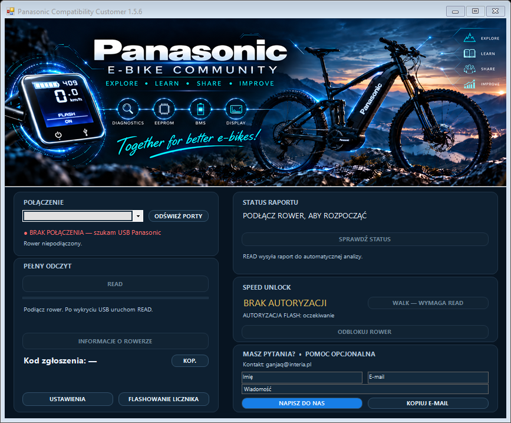
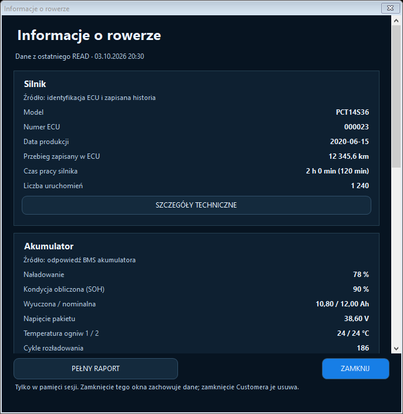
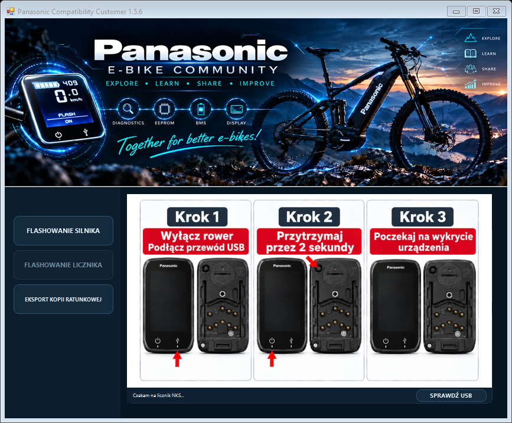

# Panasonic NEXT GEN Compatibility Customer 1.5.6

**Polski** · [English](README.en.md) · [Deutsch](README.de.md)

**Wydanie beta — kompilacja 1.5.6.3, bez podpisu cyfrowego EXE.** Windows może wyświetlić ostrzeżenie SmartScreen. Nie wyłączaj zabezpieczeń systemu; sprawdź źródło paczki i jej sumy SHA-256 przed uruchomieniem. Nowe rodziny urządzeń pozostają testowe do potwierdzenia działania na sprzęcie.

**[Pobierz kompletną paczkę ZIP beta](https://github.com/ganjaq/Panasonic_NEXT_GEN_Customer_1.5.6.2-beta/releases/download/v1.5.6.3-beta/PanasonicCustomer_1.5.6.3-beta.zip)** — rozpakuj całość do jednego folderu. Paczka zawiera program, biblioteki, sterownik i dokumentację; nie trzeba pobierać plików pojedynczo. Wszystkie pliki wydania i sumę ZIP-a znajdziesz w [Releases](https://github.com/ganjaq/Panasonic_NEXT_GEN_Customer_1.5.6.2-beta/releases/tag/v1.5.6.3-beta).

Panasonic NEXT GEN Compatibility Customer to aplikacja dla użytkowników rowerów elektrycznych z napędem Panasonic Next Gen. Umożliwia odczyt informacji o rowerze, jego diagnostykę, a zarazem sprawdza możliwości zmiany progu wspomagania jak i trybu prowadzenia roweru, zwanych dalej **SPEED** i **WALK**. Pozwala również aktualizować obsługiwane liczniki, rozszerzając je o dodatkowe funkcje.

Program rozpoznaje podłączony rower i sprawdza jego zgodność przed umożliwieniem operacji. Dostępne funkcje zależą od modelu, generacji, wersji i wyniku odczytu. Nie każdy rower z systemem Panasonic może zostać obsłużony.

To niezależny, hobbystyczny projekt społecznościowy Panasonic E-Bike Community, prowadzony przez **ganjaq**. Nie jest oficjalnym oprogramowaniem Panasonic ani projektem wspieranym przez producenta.

## Bezpłatna aplikacja i dodatkowe usługi

Pobranie aplikacji Customer i korzystanie z niej są bezpłatne. Bezpłatne są również READ, wstępna weryfikacja zgodności i informacja o dostępnych modyfikacjach. Obecnie nie pobieramy opłat także za dalszą obsługę zgłoszenia.

W przyszłości indywidualna analiza oprogramowania lub usługa jego zmiany mogą być odpłatne. Będzie to osobna, opcjonalna oferta z informacją o zakresie, cenie i warunkach przed zamówieniem. Samo pobranie programu lub wykonanie READ nie tworzą obowiązku zapłaty. Dodatkowe uprawnienie nie jest samo w sobie zakupem.

## Windows i wymagania

Pakiet jest przeznaczony dla Windows 10 w wersji x86/x64 oraz Windows 11 x64. Windows 11 ARM64, Linux i macOS nie są objęte obsługą tego wydania.

- Wymagany jest **.NET Framework 4.8**.
- Dla kompletnej procedury instalacji i sprawdzenia sterownika z dołączonym instalatorem wymagany jest **Windows 10 1903 lub nowszy**, albo Windows 11 x64.
- Bieżącą paczkę sprawdzano na Windows 10 22H2 x64. Nie potwierdzono pełnego działania wszystkich operacji na każdej wersji Windows. Lista platform docelowych nie jest taką gwarancją.
- Potrzebne są komputer bądź laptop z pobranym pakietem EXE, przewód USB oraz kompatybilny rower.
- Internet jest wymagany w normalnej procedurze READ do obsługi zgłoszenia, wysłania raportu, analizy i pobrania uprawnień. Jest także potrzebny do pobrania obrazu licznika oraz obsługi autoryzowanych operacji i przekazania ich wyników.
- Instalacja sterownika wymaga zgody administratora Windows. Nie oznacza to, że każde uruchomienie Customera wymaga podniesionych uprawnień.

W jednym folderze muszą znajdować się:

- `PanasonicCompatibilityCollector_v1.5_CUSTOMER.exe`
- `PanasonicCompatibilityCollector_v1.5_CUSTOMER.exe.config`
- `PanasonicReadCore.dll`
- `STDFU.dll`
- `STTubeDevice30.dll`

Zachowaj również folder `drivers/ST_DFU` z jego pełną zawartością. [SHA256SUMS.txt](SHA256SUMS.txt) pozwala sprawdzić integralność paczki.

## Pierwsze uruchomienie i READ

1. Pobierz pakiet plików i rozpakuj go do jednego folderu. Nie uruchamiaj EXE bezpośrednio z archiwum ZIP.
2. Zapoznaj się z [warunkami użytkowania](TERMS_OF_USE.md), [polityką prywatności](PRIVACY_POLICY.md) i [licencją](LICENSE.txt). READ przesyła dane techniczne do usługi, a nie tylko wyświetla je na komputerze.
3. Zapewnij połączenie z internetem i uruchom `PanasonicCompatibilityCollector_v1.5_CUSTOMER.exe`.
4. Podłącz rower przez właściwy przewód USB. Poczekaj na wykrycie połączenia; w razie potrzeby wybierz właściwy port.
5. Kliknij **READ** i poczekaj na zakończenie odczytu oraz obsługi raportu.
6. Sprawdź kod zgłoszenia, wynik analizy i aktualny stan funkcji. Przy odczycie częściowym lub błędzie nie traktuj samego kodu jako potwierdzenia zgodności.

READ służy do odczytu i nie wykonuje modyfikacji konfiguracji roweru. Nie jest to jednak tryb całkowicie offline: aplikacja sprawdza zgłoszenie w usłudze i może przesłać również ponowny odczyt istniejącego zgłoszenia. Brak internetu może przerwać procedurę obsługi zgłoszenia; nie gwarantujemy wtedy utworzenia nowego pliku raportu.

Język interfejsu można zmienić w **USTAWIENIACH**. Dostępne są polski, angielski i niemiecki.

## Jak powstaje raport

Nie trzeba oddzielnie wybierać eksportu EEPROM. Raport diagnostyczny jest przygotowywany podczas READ z odpowiedzi dostarczonych przez rower.

Ponowny READ istniejącego zgłoszenia może zostać wysłany bez utworzenia nowego kodu raportu.

Raport diagnostyczny nie jest publicznym załącznikiem ani automatycznie gotową kopią do odtworzenia urządzenia. Nie zamieszczaj raportów, backupów ani danych dostępu w publicznych zgłoszeniach GitHub. Szczegóły przesyłania i przechowywania danych opisuje [polityka prywatności](PRIVACY_POLICY.md).

## Automatyczne usuwanie dumpów po 30 dniach

Pełne raporty diagnostyczne, surowe odpowiedzi i pełny dump EEPROM są przechowywane tymczasowo na potrzeby analizy i obsługi zgłoszenia. Automat na backendzie usuwa je po upływie **30 dni od utworzenia zgłoszenia**, po sprawdzeniu zapisu danych potrzebnych do dalszego rozpoznawania roweru. Termin nie jest liczony od zamknięcia programu ani od ostatniego READ.

Oczekujący lub niepotwierdzony SPEED/WRITE/WALK nie blokuje usunięcia pełnego dumpu, jeśli zweryfikowany zapis rozpoznania i wymagane materiały operacji są zachowane. Przed nowym zapisem wymagany jest świeży, zweryfikowany READ tego roweru; samo rozpoznanie nie przyznaje uprawnienia do zapisu. Automat działa w tle. Jeśli weryfikacja zachowanych danych lub kasowanie nie powiedzie się, usunięcie nie jest oznaczane jako zakończone; system ponawia próbę. Termin 30 dni nie oznacza gwarancji skasowania dokładnie co do sekundy. Ta reguła dotyczy danych na backendzie, nie lokalnych kopii ratunkowych licznika.

## Informacje o rowerze

Po wykonaniu odczytu, z którego można przygotować informacje, odblokowuje się przycisk **INFORMACJE O ROWERZE**. Otwiera osobne okno z jedną przewijaną kolumną. Dane są pogrupowane według źródła:

- **Silnik:** model, numer ECU, data produkcji, przebieg zapisany w ECU, czas pracy i liczba uruchomień — zależnie od odczytu.
- **Akumulator:** dostępne dane BMS, np. naładowanie, napięcie, pojemności, obliczona kondycja SOH, temperatury i liczniki cykli. Brak odpowiedzi baterii nie jest zastępowany wymyślonymi wartościami.
- **Licznik:** obsługiwane informacje o sprzęcie, oprogramowaniu, numerze seryjnym i zapisanym przebiegu.
- **Zapisana diagnostyka:** dostępne historyczne liczniki zdarzeń i dodatkowe dane techniczne, z opisem źródła.

SOH jest wskaźnikiem pojemności, a nie oceną bezpieczeństwa akumulatora. Przebiegi silnika i licznika mogą się różnić. Zdarzenia historyczne nie oznaczają automatycznie usterki występującej w chwili odczytu.

Informacje przedstawiają stan z odczytu, nie pomiar na żywo. Okno nie zapisuje ani nie eksportuje danych do pliku. Zamknięcie okna zachowuje podgląd do końca sesji programu; kolejny odczyt może go aktualizować. Zamknięcie całego Customera kończy tę sesję. Nie usuwa to danych zgłoszenia ani raportów w usłudze — są to osobne mechanizmy.

## SPEED i WALK

**SPEED** umożliwia zmianę progu wspomagania w zakwalifikowanym rowerze. Zakres działania zależy od obsługiwanej konfiguracji; podczas testów zauważono, że w zależności od posiadanego silnika te same zmiany przynoszą różne rezultaty. Dla niektórych modeli silników prędkość końcowa może być nieco wyższa niż wcześniej zakładana 32 km/h.

**WALK** modyfikuje działanie trybu prowadzenia roweru. Dla obsługiwanych konfiguracji celem konfiguracji jest **25 km/h**. Rzeczywisty efekt zależy od urządzenia i warunków użytkowania (masa własna, ukształtowanie terenu). Funkcja pozostaje oznaczona jako **TESTOWA**, choć wykazano jej działanie na testowanych egzemplarzach.

Przyznanie dodatkowych uprawnień pozwala skorzystać ze zgodnych funkcji. Obecnie podstawowe funkcje są bezpłatne. Oznaczenia dotyczące płatności w interfejsie nie stanowią same w sobie naliczenia opłaty.

SPEED i WALK uruchamia się osobno. Przed zapisem program ponownie sprawdza podłączony rower, a po zapisie wykonuje odczyt potwierdzający. Nie traktuj samego rozpoczęcia operacji jako jej zakończenia. Przy wyniku niepotwierdzonym nie ponawiaj zapisu w ciemno: sprawdź stan i skontaktuj się z pomocą.

## Licznik — DISPLAY FLASH i backup

DISPLAY FLASH umożliwia identyfikację obsługiwanego licznika, wykonanie kopii zapasowej i zapis zgodnego obrazu.

1. Wykonaj READ w głównym oknie.
2. Otwórz **DISPLAY FLASH**.
3. Przejdź do Bootloader zgodnie z instrukcją w aplikacji. Tryb Bootloader jest innym trybem USB niż wcześniejsze połączenie.
4. Wykonaj **READ BACKUP**.
5. Poczekaj na ukończenie kopii i sprawdzenie zgodności. Zapis jest dostępny tylko po spełnieniu wymagań programu.

Obsługiwane są potwierdzone warianty **NKS348S** i **NKS442S** z identyfikacją sprzętu **8001**, oprogramowania **0210** i **SW0**. Program sprawdza odczytaną zawartość — nazwa licznika sama nie potwierdza zgodności.

Kopia licznika jest zapisywana lokalnie w folderze **%LOCALAPPDATA%\PanasonicCollector\NksBackups** i zabezpieczana dla bieżącego użytkownika Windows. **EXPORT RECOVERY COPY** pozwala wyeksportować kopię ratunkową w wybrane miejsce. Zachowaj ją przed zmianą komputera lub konta Windows. Zamknięcie programu nie kasuje tych kopii.

Raport READ nie zastępuje niezależnej, zweryfikowanej kopii do odtworzenia silnika. Customer nie oferuje w tym wydaniu uniwersalnego przywracania każdego urządzenia z raportu READ.

### Tempomat

Zgodny obraz licznika może udostępnić funkcję WALK bez stałego trzymania przycisku, nazywaną **TEMPOMATEM**. Dla obsługiwanego wariantu włącz tę opcję w ukrytym menu licznika, a następnie przytrzymaj przycisk prowadzenia przez około 2 sekundy. Według instrukcji tego wariantu wyłączenie następuje po naciśnięciu przycisku pilota lub odpowiednim spadku prędkości podczas hamowania. Nie zakładaj identycznego zachowania innego obrazu lub licznika; sprawdź instrukcję i działanie w bezpiecznych warunkach.

## Sterownik USB DFU — PnPUtil, bez DPInst

Pakiet sterownika ST znajduje się w **drivers/ST_DFU**. Jeśli licznik w DFU nie jest wykrywany:

1. Zachowaj cały folder sterownika, łącznie z podfolderami x86/x64. Nie instaluj sterownika podczas READ BACKUP ani FLASH.
2. Uruchom `drivers/ST_DFU/Install_DFU.cmd` i zatwierdź instalację oraz zgodę administratora Windows.
3. Podłącz obsługiwany licznik w trybie DFU, a następnie wybierz **ODŚWIEŻ USB DFU** lub **SPRAWDŹ USB** w Customerze.

Instalator używa **PnPUtil dostarczanego z Windows**. Instalacja sterownika nie zapisuje firmware. Potwierdzenie dodania pakietu bez podłączonego urządzenia nie oznacza potwierdzenia komunikacji z licznikiem. Nie każdy błąd USB wynika z braku sterownika.

Instalację można również wykonać z terminala administratora otwartego w folderze programu:

```powershell
pnputil /add-driver ".\drivers\ST_DFU\STtube.inf" /install
```

Polecenie instaluje oryginalny pakiet na pasujących urządzeniach; nie wymusza zastąpienia lepiej dopasowanego sterownika. Samo `/add-driver /install` jest dostępne od Windows 10 1607, ale pełne końcowe sprawdzenie interfejsu w naszym instalatorze wymaga 1903 lub nowszego. Nie wyłączaj weryfikacji podpisów sterowników.

Zobacz [instrukcję sterownika](drivers/ST_DFU/README.md), [dokumentację PnPUtil Microsoft](https://learn.microsoft.com/en-us/windows-hardware/drivers/devtest/pnputil-command-syntax) i [oryginalny pakiet DfuSe ST](https://www.st.com/en/development-tools/stsw-stm32080.html). Składniki ST podlegają pełnej [licencji SLA0044](drivers/ST_DFU/SLA0044.txt).

## Ostrzeżenie dotyczące WRITE/FLASH

WRITE/FLASH może zmienić konfigurację lub oprogramowanie urządzenia. Błąd, niezgodny plik, przerwanie zasilania albo USB mogą prowadzić do utraty danych lub nieprawidłowego działania. Backup zmniejsza ryzyko, ale nie gwarantuje naprawy ani możliwości odtworzenia każdej sytuacji.

Operacje wykonuj tylko na urządzeniach, do których obsługi masz prawo. Nie odłączaj USB ani zasilania podczas zapisu. Funkcje testowe nie stanowią gwarancji bezpieczeństwa, zgodności z każdym modelem ani dopuszczenia roweru do ruchu drogowego. Modyfikacje mogą wpływać na bezpieczeństwo, gwarancję producenta i obowiązki dotyczące użytkowania pojazdu. Sprawdź przepisy właściwe dla miejsca użytkowania.

## Pomoc i kontakt

Kontakt: [ganjaq@interia.pl](mailto:ganjaq@interia.pl).

Podaj wersję programu, kod zgłoszenia i opis etapu, na którym wystąpił problem. Formularz w aplikacji przygotowuje wiadomość w programie pocztowym; wysyłasz ją samodzielnie. Nie udostępniaj publicznie raportów, backupów, danych dostępu ani zrzutów z danymi innych osób. Projekt jest hobbystyczny; nie deklaruje całodobowej pomocy ani gwarantowanego czasu odpowiedzi.

## Dokumenty i podgląd

- [Warunki użytkowania](TERMS_OF_USE.md)
- [Polityka prywatności](PRIVACY_POLICY.md)
- [Licencja własnych części programu](LICENSE.txt)







Wersja programu: **1.5.6**, kompilacja beta **1.5.6.3**. Polski tekst zatwierdzony przez właściciela 7 października 2026 r.; opis retencji i informacje o wydaniu beta zaktualizowano 8 października 2026 r. README jest dostępne także po angielsku i niemiecku. Polityka prywatności opisuje wdrożony automat, ale nadal jawnie wskazuje niepotwierdzone kwestie dotyczące infrastruktury i podstaw prawnych. Wydanie beta nie oznacza zakończenia tych weryfikacji.
